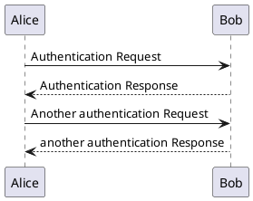
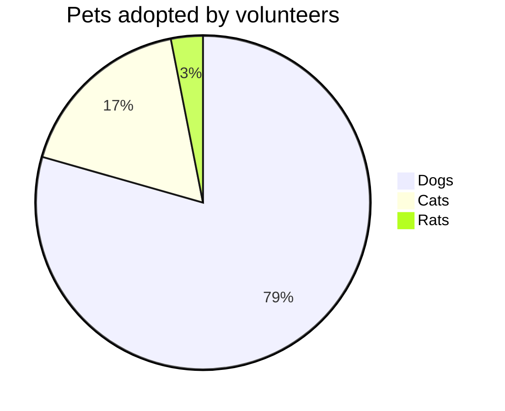

# Welcome to Slidev

---

# This is the second slide

* You can add some bullet points
* Here is another one

---
layout: image-right
image: images/tools.jpg
---

# This is a slide with an image on the right 

* Bullet points will be properly wrapped on the left side of the slide

---

# Styling with UnoCSS

<div class="grid grid-cols-2">
    <div class="text-green-600 text-2xl">Left</div>
    <div class="text-red-400 text-2xl">Right</div>
</div>

---

# Icons

## As CSS class

<div class="flex items-center gap-4 mb-8">
    <div class="i-solar-bag-music-outline" ></div>
    <div class="i-solar-bag-music-outline text-4xl" ></div>
</div>

## As component

<div class="flex items-center gap-4">
    <solar-bag-music-outline />
    <solar-bag-music-outline class="text-red-600 text-4xl" />
</div>

---
layout: three-icons
firstIcon: i-solar-server-2-linear
secondIcon: 'i-solar-leaf-line-duotone text-green-600'
thirdIcon: i-devicon-html5
---

# Thymeleaf

::first::

Server-side rendering

::second::

Natural templating

::third::

Generates HTML

---

# Some code blocks

<v-clicks every="2">

* Java
```java
public record User(String name, LocalDate birthday) {
}
```

* HTML
```html
<div class="flex gap-4">
  <div>Syntax highlighting is built-in</div>
</div>
```

* JavaScript
```javascript
export function sayHello() {
  console.log('Hello')
}
```

</v-clicks>

---

# Code highlighting

```java {7,13|5|6|9-12|*}
import org.springframework.stereotype.Controller;
import org.springframework.web.bind.annotation.RequestMapping;
import org.springframework.web.bind.annotation.GetMapping;

@Controller
@RequestMapping("/")
public void HomeController {

  @GetMapping
  public String index() {
    return "index";
  }
}
```

---

# Code Magic Move

````md magic-move
```js
console.log(`Step ${1}`)
```
```js
console.log(`Step ${1 + 1}`)
```
```ts
console.log(`Step ${1 + 1}`)
console.log('Done')
```
````

---

# Rough markers

You can <span v-mark.red>underline</span> or <span v-mark.highlight.yellow>highlight</span> words in the presentation.


---

# Use an arrow to point at things

* This is item 1
* This item 2 will be pointed at
* This is item 3

<Arrow x1="320" y1="223" x2="249" y2="155" />

---

# Use an arrow to point at things

* This is item 1
* This item 2 will be pointed at
* This is item 3

<Arrow v-click x1="320" y1="223" x2="249" y2="155" class="text-gray-400"/>
<div v-after class="absolute top-[225px] left-[250px] text-gray-400">
Item 2 is very important
</div>

---

# Table

Here's a simple markdown table with 5 NBA stars and some fictional statistics:

| Player                | Points per Game | Rebounds per Game |
|-----------------------|-----------------|-------------------|
| LeBron James          | 28.4            | 8.7               |
| Giannis Antetokounmpo | 31.2            | 12.5              |
| Kevin Durant          | 29.8            | 7.3               |
| Joel Embiid           | 33.1            | 11.8              |
| Luka Doncic           | 32.6            | 9.4               |

---

# Features

| Feature            | Slidev                                                                         | PowerPoint                                                                                          |
|--------------------|--------------------------------------------------------------------------------|-----------------------------------------------------------------------------------------------------|
| Developer-Friendly | <solar-clipboard-check-linear class="text-green-700" /> Markdown               | <solar-clipboard-remove-linear class="text-red-700"/>                                               |
| Version Control    | <solar-clipboard-check-linear class="text-green-700" /> Git-friendly           | <solar-clipboard-remove-linear class="text-red-700"/> Binary files                                  |
| Animations         | <solar-shield-warning-linear class="text-orange-700"/> CSS animations          | <solar-clipboard-check-linear class="text-green-700" /> Rich animation library |
| Customization      | <solar-clipboard-check-linear class="text-green-700" /> CSS and Vue components | <solar-shield-warning-linear class="text-orange-700"/> Built-in themes                              |

---

# PlantUML sequence diagram

<style>
    img {
        height: 80%;
        margin: auto;
    }
</style>



---

# Mermaid diagram



---

# Custom SVG import

<script setup>
import FireFoxLogo from './components/FirefoxLogo.svg?raw';
</script>

<div v-html="FireFoxLogo"></div>

---

# X/Twitter embed

<div class="tweet-container">
<blockquote class="twitter-tweet"><p lang="en" dir="ltr">just setting up my twttr</p>&mdash; jack (@jack) <a href="https://twitter.com/jack/status/20?ref_src=twsrc%5Etfw">March 21, 2006</a></blockquote>
</div>

---